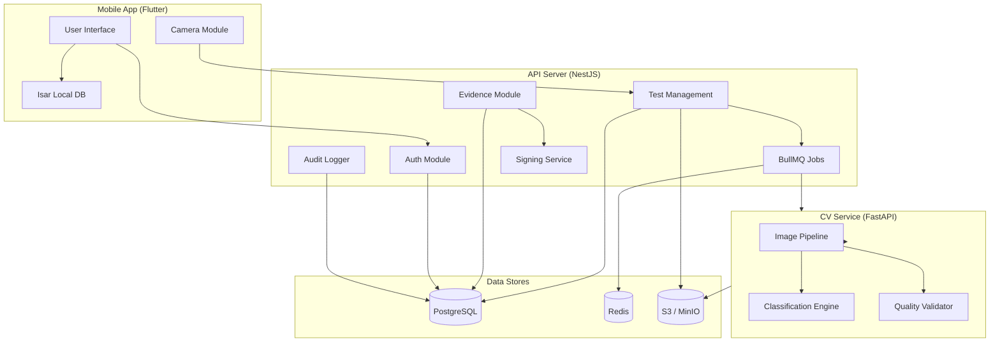
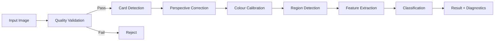
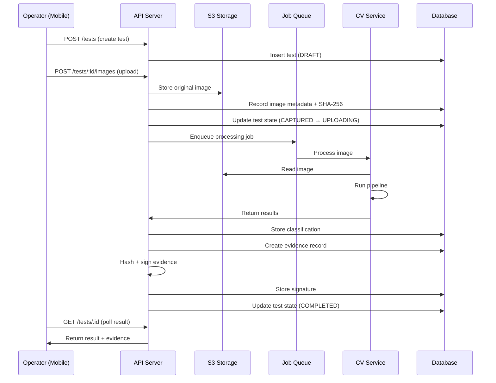
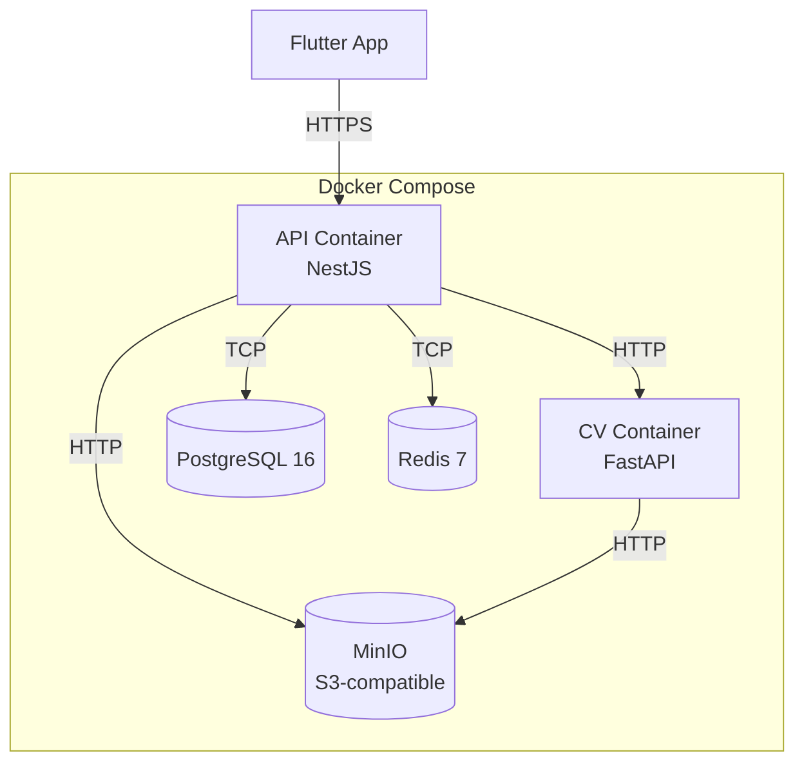

# FieldSure — Architecture

## System Overview

FieldSure is a three-tier system composed of a mobile client, a REST API backend, and a computer-vision microservice, backed by PostgreSQL, Redis, and S3-compatible object storage.



## Mobile Architecture

### Pattern: Feature-First with Riverpod

```
lib/
├── core/
│   ├── constants/
│   ├── theme/
│   ├── utils/
│   ├── network/          # Dio client, interceptors
│   ├── storage/          # Secure storage, Isar
│   └── widgets/          # Reusable widgets
├── features/
│   ├── auth/
│   │   ├── data/         # Repositories, data sources
│   │   ├── domain/       # Models, interfaces
│   │   └── presentation/ # Screens, widgets, providers
│   ├── test/
│   ├── camera/
│   ├── evidence/
│   ├── history/
│   ├── sync/
│   ├── profile/
│   └── settings/
├── routing/
│   └── app_router.dart
└── main.dart
```

### State Management

- **Riverpod** providers for all state
- `AsyncNotifierProvider` for async operations
- `StateNotifierProvider` for complex state
- Provider scoping for feature isolation

### Networking

- **Dio** HTTP client with interceptors for:
  - JWT token injection
  - Token refresh on 401
  - Request/response logging
  - Connectivity checking

### Offline Strategy

- **Isar** for local persistence
- Tests created offline get state `PENDING_SYNC`
- Client generates UUIDs for all entities
- Sync queue with retry logic
- Connectivity monitoring via `connectivity_plus`

## Backend Architecture

### Pattern: NestJS Modular

```
src/
├── auth/
│   ├── auth.module.ts
│   ├── auth.controller.ts
│   ├── auth.service.ts
│   ├── strategies/
│   ├── guards/
│   └── dto/
├── users/
├── tests/
├── images/
├── processing/
├── evidence/
├── audit/
├── kits/
├── common/
│   ├── decorators/
│   ├── filters/
│   ├── interceptors/
│   ├── guards/
│   └── pipes/
├── config/
├── prisma/
└── main.ts
```

### Security Layers

1. **Helmet** — HTTP security headers
2. **CORS** — Restricted origins
3. **Rate Limiting** — `@nestjs/throttler`
4. **JWT Guard** — Authentication
5. **RBAC Guard** — Authorization
6. **Validation Pipe** — DTO validation
7. **Exception Filter** — Error sanitization

### Job Processing

- **BullMQ** + **Redis** for async image processing
- Job flow:
  1. Image uploaded → job enqueued
  2. Worker calls CV service
  3. Result stored in database
  4. Client polls or receives push notification

## CV Service Architecture

### Pattern: Pipeline

```
app/
├── api/
│   ├── routes/
│   └── dependencies.py
├── core/
│   ├── config.py
│   └── logging.py
├── pipeline/
│   ├── quality.py         # Image quality validation
│   ├── detection.py        # Reference card detection
│   ├── correction.py       # Perspective correction
│   ├── calibration.py      # Colour calibration
│   ├── extraction.py       # Feature extraction
│   ├── classification.py   # Kit-specific classification
│   └── orchestrator.py     # Pipeline coordinator
├── models/
│   ├── requests.py
│   └── responses.py
└── config/
    └── kits/               # Kit-specific classification configs
```

### Pipeline Flow



### Classification Design

- **Configuration-driven** — each kit has a YAML/JSON config defining:
  - Expected regions
  - Colour ranges for each result
  - Confidence thresholds
  - Quality requirements
- **Kit-specific** — no universal classifier
- **INCONCLUSIVE** always available
- **No forced classification** on ambiguous inputs

## Evidence Architecture

### Record Composition

```
Evidence Record = {
  test_id,
  image_ref,
  image_hash (SHA-256),
  operator_id,
  server_timestamp,
  gps { lat, lon, accuracy },
  device_id,
  kit_id,
  classification,
  confidence,
  algorithm_version,
  model_version,
  config_version
}
```

### Integrity Chain

1. **Image Hash** — SHA-256 of original image bytes
2. **Record Hash** — SHA-256 of canonical JSON of evidence record
3. **Digital Signature** — Asymmetric signature of record hash
4. **Verification** — Re-compute hash, verify signature against public key

### Signing Abstraction

```typescript
interface SigningService {
  sign(data: Buffer): Promise<{ signature: string; keyId: string }>;
  verify(data: Buffer, signature: string, keyId: string): Promise<boolean>;
}
```

Implementations:
- `LocalSigningService` — File-based keys (development)
- `KmsSigningService` — AWS KMS / Azure Key Vault (production)
- `HsmSigningService` — Hardware Security Module (high-security)

## Data Flow



## Deployment Architecture


