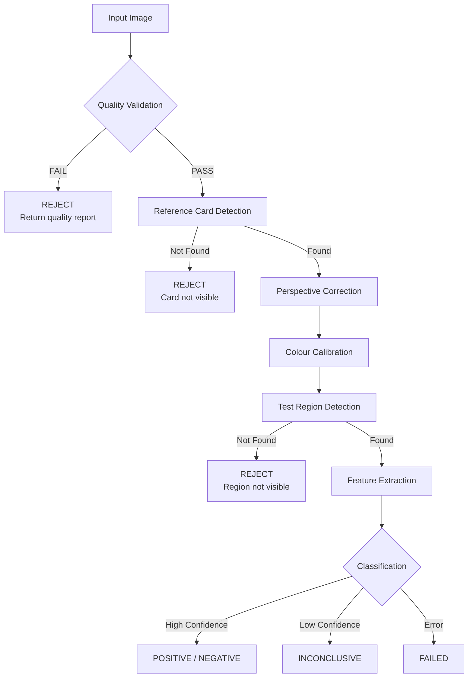

# FieldSure — Computer Vision Pipeline

## Overview

The CV pipeline processes images captured by field operators to classify the result of colorimetric drug tests. It receives images via internal API calls from the backend, processes them through a series of stages, and returns a structured classification result.

> **Important:** Classification is configuration-driven and kit-specific. The pipeline does not use hardcoded drug-specific thresholds. Demo/placeholder configurations must be clearly identified.

## Pipeline Stages



## Stage 1: Quality Validation

**Purpose:** Ensure the image meets minimum quality requirements before processing.

### Checks

| Check | Method | Threshold | Action on Fail |
|---|---|---|---|
| Resolution | Pixel dimensions | ≥1920px on shortest side | REJECT |
| Blur | Laplacian variance | Score > configurable min | REJECT |
| Brightness | Mean pixel intensity | 50–200 range (configurable) | REJECT |
| Exposure | Histogram analysis | No extreme clipping | WARNING or REJECT |
| Glare | Specular highlight detection | < configurable % of area | WARNING |
| Card Visibility | Contour/marker detection | Card detected in frame | REJECT |
| Region Visibility | ROI detection | Test area visible | REJECT |
| Corruption | File header / decode check | Valid JPEG/PNG | REJECT |

### Output
```python
class QualityResult:
    overall: QualityStatus  # PASS, FAIL, WARNING
    checks: dict[str, CheckResult]
    recommendations: list[str]  # User-facing guidance
```

## Stage 2: Reference Card Detection

**Purpose:** Locate the reference colour card in the image for calibration.

### Approach Options
1. **ArUco Markers** — If reference cards include printed ArUco markers
2. **Contour-Based** — Detect rectangular card shape by contour analysis
3. **Template Matching** — Match known card template

### Output
- Detected card corners (4 points)
- Card bounding box
- Detection confidence

## Stage 3: Perspective Correction

**Purpose:** Transform the image to a fronto-parallel view of the reference card and test region.

### Method
1. Compute homography from detected card corners to canonical rectangle
2. Apply `cv2.warpPerspective` to extract card region
3. Normalize orientation

### Output
- Corrected card image (fixed dimensions)
- Transformation matrix

## Stage 4: Colour Calibration

**Purpose:** Normalize colours using the reference card to account for device camera variance and lighting conditions.

### Method
1. Extract colour patch values from the reference card
2. Compare to known reference values
3. Compute colour correction matrix (affine transform in colour space)
4. Apply correction to the test region

### Output
- Colour correction matrix
- Corrected test region image
- Calibration quality score

## Stage 5: Test Region Detection

**Purpose:** Locate the specific test reaction area within the corrected image.

### Method
- Region location relative to reference card (kit-specific configuration)
- Contour-based detection within expected area
- Validate region shape and size

### Output
- Cropped test region
- Region coordinates
- Detection confidence

## Stage 6: Feature Extraction

**Purpose:** Extract colour features from the test region for classification.

### Features
- Mean colour (RGB, HSV, Lab colour spaces)
- Colour histogram
- Dominant colour clusters (k-means)
- Colour uniformity score
- Standard deviation per channel
- Custom kit-specific features

### Output
```python
class ExtractedFeatures:
    mean_rgb: tuple[float, float, float]
    mean_hsv: tuple[float, float, float]
    mean_lab: tuple[float, float, float]
    histogram: dict[str, list[float]]
    dominant_colors: list[tuple[float, float, float]]
    uniformity: float
    std_dev: dict[str, float]
    custom: dict[str, Any]  # Kit-specific
```

## Stage 7: Classification

**Purpose:** Determine the test result based on extracted features and kit-specific configuration.

### Approach
- **Configuration-driven** — each kit defines its classification rules
- **No universal model** — different kits have different colour mappings
- **INCONCLUSIVE always available** — ambiguous results are never forced

### Classification Config Structure
```yaml
kit_code: "MARQUIS_001"
version: "1.0.0"
is_demo: true  # MUST be set for placeholder data
method: "colour_threshold"  # or "svm", "nearest_centroid"
colour_space: "Lab"
classes:
  - name: "POSITIVE_Methamphetamine"
    result: "POSITIVE"
    substance: "Methamphetamine"
    centroid: [45.2, 28.1, -15.3]
    max_distance: 20.0
  - name: "POSITIVE_MDMA"
    result: "POSITIVE"
    substance: "MDMA"
    centroid: [32.1, 45.6, -8.2]
    max_distance: 18.0
  - name: "NEGATIVE"
    result: "NEGATIVE"
    centroid: [78.5, 2.1, 5.4]
    max_distance: 25.0
inconclusive_threshold: 0.6  # Below this confidence → INCONCLUSIVE
```

> ⚠️ **All values above are placeholders for demonstration. Real classification parameters require validated colour data from actual test kits under controlled conditions.**

### Decision Logic
1. Compute distance from extracted features to each class centroid
2. Select nearest class
3. Compute confidence (inverse of normalized distance)
4. If confidence < `inconclusive_threshold` → INCONCLUSIVE
5. If multiple classes within threshold → INCONCLUSIVE

### Output
```python
class ClassificationResult:
    result: Literal["POSITIVE", "NEGATIVE", "INCONCLUSIVE"]
    confidence: float | None
    detected_substance: str | None
    distances: dict[str, float]  # Distance to each class
    method: str
    config_version: str
```

## Diagnostics Output

Each processing run generates diagnostic data for audit and debugging:

```python
class PipelineDiagnostics:
    processing_time_ms: int
    steps: list[StepLog]  # Per-stage timing and status
    annotated_image_url: str | None  # Image with overlaid detection regions
    quality_report: QualityResult
    features: ExtractedFeatures
    classification_details: dict  # Method-specific debug data
```

## Future Considerations

- **PyTorch models:** Only introduce if validated training data becomes available
- **Transfer learning:** Fine-tune pre-trained models on actual kit images
- **Multi-kit batching:** Process multiple test regions from a single image
- **Real-time preview:** Client-side quality assessment before capture
- **Continuous calibration:** Track colour drift across devices over time
