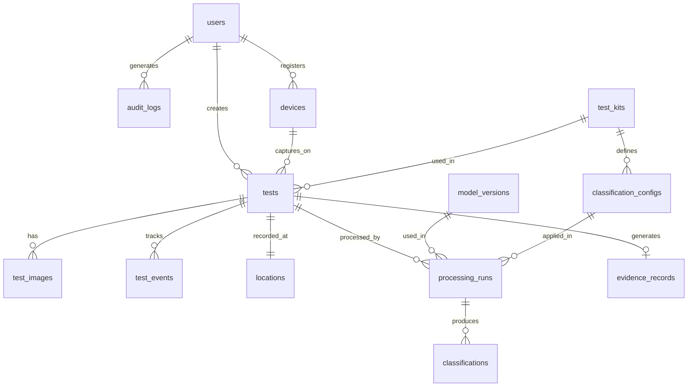
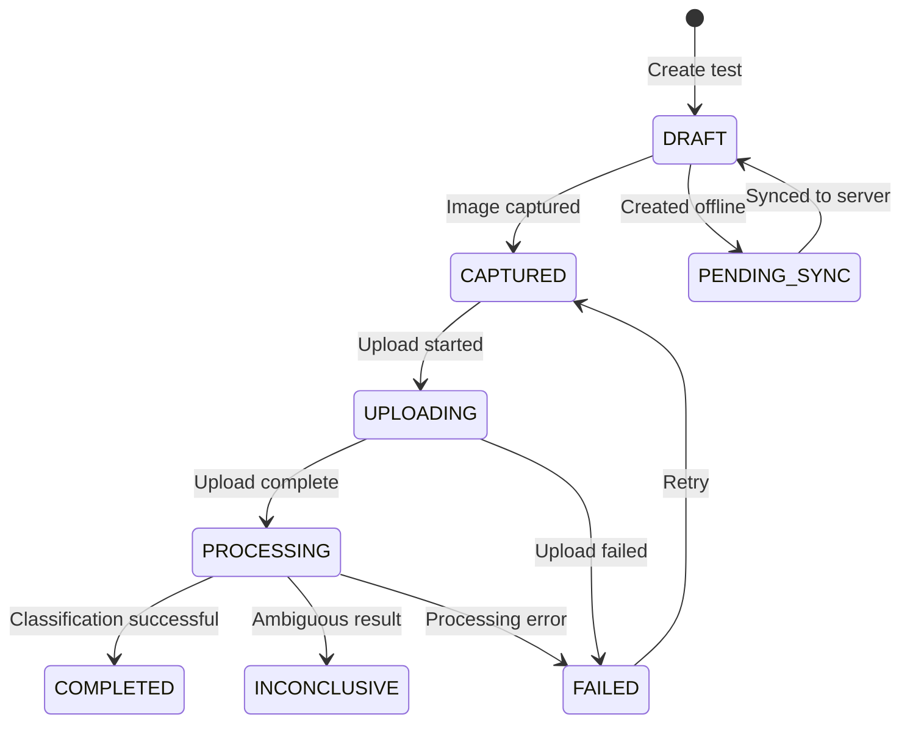

# FieldSure — Database Schema

## Entity-Relationship Overview



## Enums

```sql
-- User roles
CREATE TYPE user_role AS ENUM ('ADMIN', 'SUPERVISOR', 'OPERATOR');

-- Test lifecycle states
CREATE TYPE test_state AS ENUM (
  'DRAFT',
  'CAPTURED',
  'UPLOADING',
  'PROCESSING',
  'COMPLETED',
  'INCONCLUSIVE',
  'FAILED',
  'PENDING_SYNC'
);

-- Classification results
CREATE TYPE classification_result AS ENUM (
  'POSITIVE',
  'NEGATIVE',
  'INCONCLUSIVE'
);

-- Audit event types
CREATE TYPE audit_event_type AS ENUM (
  'LOGIN',
  'LOGOUT',
  'TEST_CREATED',
  'IMAGE_CAPTURED',
  'IMAGE_UPLOADED',
  'IMAGE_HASHED',
  'PROCESSING_STARTED',
  'PROCESSING_COMPLETED',
  'CLASSIFICATION_CREATED',
  'EVIDENCE_SIGNED',
  'RECORD_VIEWED',
  'RECORD_VERIFIED',
  'RECORD_EXPORTED',
  'SYNC_STARTED',
  'SYNC_COMPLETED',
  'ERROR'
);

-- Image quality status
CREATE TYPE quality_status AS ENUM ('PASS', 'FAIL', 'WARNING');

-- Processing status
CREATE TYPE processing_status AS ENUM ('PENDING', 'RUNNING', 'COMPLETED', 'FAILED');
```

## Tables

### users

| Column | Type | Constraints | Description |
|---|---|---|---|
| id | UUID | PK, DEFAULT gen_random_uuid() | |
| email | VARCHAR(255) | UNIQUE, NOT NULL | Login identifier |
| password_hash | VARCHAR(255) | NOT NULL | bcrypt/argon2 hash |
| full_name | VARCHAR(255) | NOT NULL | Display name |
| badge_number | VARCHAR(100) | UNIQUE | Officer badge/ID |
| role | user_role | NOT NULL, DEFAULT 'OPERATOR' | RBAC role |
| is_active | BOOLEAN | NOT NULL, DEFAULT true | Account status |
| last_login_at | TIMESTAMPTZ | | Last successful login |
| created_at | TIMESTAMPTZ | NOT NULL, DEFAULT now() | |
| updated_at | TIMESTAMPTZ | NOT NULL, DEFAULT now() | |

**Indexes:** email (unique), badge_number (unique), role

### devices

| Column | Type | Constraints | Description |
|---|---|---|---|
| id | UUID | PK | |
| user_id | UUID | FK → users.id, NOT NULL | Registered by |
| device_name | VARCHAR(255) | | Human-readable device name |
| device_model | VARCHAR(255) | | Hardware model |
| os_version | VARCHAR(100) | | Android/iOS version |
| app_version | VARCHAR(50) | | FieldSure app version |
| device_fingerprint | VARCHAR(255) | UNIQUE | Unique device identifier |
| is_active | BOOLEAN | NOT NULL, DEFAULT true | |
| registered_at | TIMESTAMPTZ | NOT NULL, DEFAULT now() | |
| last_seen_at | TIMESTAMPTZ | | |

**Indexes:** user_id, device_fingerprint (unique)

### test_kits

| Column | Type | Constraints | Description |
|---|---|---|---|
| id | UUID | PK | |
| name | VARCHAR(255) | NOT NULL | Kit display name |
| manufacturer | VARCHAR(255) | | Kit manufacturer |
| kit_code | VARCHAR(100) | UNIQUE, NOT NULL | Unique kit identifier |
| description | TEXT | | Usage description |
| target_substances | JSONB | | List of target substances |
| instructions | TEXT | | Operator instructions |
| is_active | BOOLEAN | NOT NULL, DEFAULT true | |
| created_at | TIMESTAMPTZ | NOT NULL, DEFAULT now() | |
| updated_at | TIMESTAMPTZ | NOT NULL, DEFAULT now() | |

**Indexes:** kit_code (unique), is_active

### classification_configs

| Column | Type | Constraints | Description |
|---|---|---|---|
| id | UUID | PK | |
| kit_id | UUID | FK → test_kits.id, NOT NULL | |
| version | VARCHAR(50) | NOT NULL | Config version string |
| config_data | JSONB | NOT NULL | Kit-specific classification parameters |
| is_demo | BOOLEAN | NOT NULL, DEFAULT false | Marks demo/placeholder configs |
| is_active | BOOLEAN | NOT NULL, DEFAULT true | |
| created_at | TIMESTAMPTZ | NOT NULL, DEFAULT now() | |

**Indexes:** kit_id + version (unique), kit_id + is_active

### model_versions

| Column | Type | Constraints | Description |
|---|---|---|---|
| id | UUID | PK | |
| name | VARCHAR(255) | NOT NULL | Model/algorithm name |
| version | VARCHAR(50) | NOT NULL | Semantic version |
| description | TEXT | | What changed |
| algorithm_type | VARCHAR(100) | NOT NULL | e.g. "colour_threshold", "svm" |
| is_active | BOOLEAN | NOT NULL, DEFAULT true | |
| created_at | TIMESTAMPTZ | NOT NULL, DEFAULT now() | |

**Indexes:** name + version (unique)

### tests

| Column | Type | Constraints | Description |
|---|---|---|---|
| id | UUID | PK | Client-generated for offline support |
| operator_id | UUID | FK → users.id, NOT NULL | |
| device_id | UUID | FK → devices.id | |
| kit_id | UUID | FK → test_kits.id | |
| state | test_state | NOT NULL, DEFAULT 'DRAFT' | Current lifecycle state |
| case_number | VARCHAR(255) | | External case reference |
| sample_id | VARCHAR(255) | | Sample identifier |
| sample_description | TEXT | | Free-text description |
| notes | TEXT | | Operator notes |
| client_created_at | TIMESTAMPTZ | | Timestamp from mobile device |
| created_at | TIMESTAMPTZ | NOT NULL, DEFAULT now() | Server timestamp |
| updated_at | TIMESTAMPTZ | NOT NULL, DEFAULT now() | |

**Indexes:** operator_id, kit_id, state, case_number, created_at DESC

### test_images

| Column | Type | Constraints | Description |
|---|---|---|---|
| id | UUID | PK | |
| test_id | UUID | FK → tests.id, NOT NULL | |
| image_type | VARCHAR(50) | NOT NULL | 'reaction', 'reference_card', etc. |
| storage_key | VARCHAR(500) | NOT NULL | S3 object key |
| storage_bucket | VARCHAR(255) | NOT NULL | S3 bucket name |
| original_filename | VARCHAR(255) | | |
| mime_type | VARCHAR(100) | NOT NULL | |
| file_size_bytes | BIGINT | NOT NULL | |
| sha256_hash | VARCHAR(64) | NOT NULL | Hex-encoded SHA-256 |
| width | INTEGER | | Image width in pixels |
| height | INTEGER | | Image height in pixels |
| quality_status | quality_status | | Quality check result |
| quality_details | JSONB | | Detailed quality metrics |
| captured_at | TIMESTAMPTZ | | Device capture timestamp |
| uploaded_at | TIMESTAMPTZ | NOT NULL, DEFAULT now() | |

**Indexes:** test_id, sha256_hash

### locations

| Column | Type | Constraints | Description |
|---|---|---|---|
| id | UUID | PK | |
| test_id | UUID | FK → tests.id, UNIQUE, NOT NULL | One location per test |
| latitude | DECIMAL(10, 7) | NOT NULL | |
| longitude | DECIMAL(10, 7) | NOT NULL | |
| accuracy_meters | DECIMAL(8, 2) | | GPS accuracy |
| altitude_meters | DECIMAL(10, 2) | | |
| recorded_at | TIMESTAMPTZ | NOT NULL | |

**Indexes:** test_id (unique), lat/lon

### processing_runs

| Column | Type | Constraints | Description |
|---|---|---|---|
| id | UUID | PK | |
| test_id | UUID | FK → tests.id, NOT NULL | |
| image_id | UUID | FK → test_images.id, NOT NULL | |
| model_version_id | UUID | FK → model_versions.id | |
| config_id | UUID | FK → classification_configs.id | |
| status | processing_status | NOT NULL, DEFAULT 'PENDING' | |
| started_at | TIMESTAMPTZ | | |
| completed_at | TIMESTAMPTZ | | |
| duration_ms | INTEGER | | Processing time |
| pipeline_log | JSONB | | Step-by-step pipeline output |
| error_message | TEXT | | Error details if failed |
| created_at | TIMESTAMPTZ | NOT NULL, DEFAULT now() | |

**Indexes:** test_id, image_id, status

### classifications

| Column | Type | Constraints | Description |
|---|---|---|---|
| id | UUID | PK | |
| processing_run_id | UUID | FK → processing_runs.id, NOT NULL | |
| test_id | UUID | FK → tests.id, NOT NULL | |
| result | classification_result | NOT NULL | POSITIVE / NEGATIVE / INCONCLUSIVE |
| confidence | DECIMAL(5, 4) | | 0.0000 – 1.0000 |
| detected_substance | VARCHAR(255) | | If identified |
| raw_features | JSONB | | Extracted colour features |
| diagnostics | JSONB | | Debug/diagnostic data |
| created_at | TIMESTAMPTZ | NOT NULL, DEFAULT now() | |

**Indexes:** test_id, processing_run_id, result

### evidence_records

| Column | Type | Constraints | Description |
|---|---|---|---|
| id | UUID | PK | |
| test_id | UUID | FK → tests.id, UNIQUE, NOT NULL | One evidence record per test |
| image_ref | VARCHAR(500) | NOT NULL | S3 key of original image |
| image_hash | VARCHAR(64) | NOT NULL | SHA-256 of original image |
| operator_id | UUID | FK → users.id, NOT NULL | |
| server_timestamp | TIMESTAMPTZ | NOT NULL | Authoritative timestamp |
| gps_latitude | DECIMAL(10, 7) | | |
| gps_longitude | DECIMAL(10, 7) | | |
| gps_accuracy | DECIMAL(8, 2) | | |
| device_id | UUID | FK → devices.id | |
| kit_id | UUID | FK → test_kits.id, NOT NULL | |
| classification | classification_result | NOT NULL | |
| confidence | DECIMAL(5, 4) | | |
| algorithm_version | VARCHAR(50) | NOT NULL | |
| model_version | VARCHAR(50) | | |
| config_version | VARCHAR(50) | NOT NULL | |
| record_hash | VARCHAR(64) | NOT NULL | SHA-256 of canonical record |
| signature | TEXT | NOT NULL | Digital signature (Base64) |
| signature_key_id | VARCHAR(255) | NOT NULL | Key identifier for verification |
| verification_status | VARCHAR(50) | NOT NULL, DEFAULT 'SIGNED' | |
| created_at | TIMESTAMPTZ | NOT NULL, DEFAULT now() | |

**Indexes:** test_id (unique), operator_id, record_hash, created_at DESC

### audit_logs

| Column | Type | Constraints | Description |
|---|---|---|---|
| id | UUID | PK | |
| event_type | audit_event_type | NOT NULL | |
| user_id | UUID | FK → users.id | Actor (null for system events) |
| resource_type | VARCHAR(100) | | 'test', 'image', 'evidence', etc. |
| resource_id | UUID | | ID of affected resource |
| details | JSONB | | Event-specific data |
| ip_address | VARCHAR(45) | | Client IP |
| user_agent | VARCHAR(500) | | Client user agent |
| created_at | TIMESTAMPTZ | NOT NULL, DEFAULT now() | |

**Indexes:** event_type, user_id, resource_type + resource_id, created_at DESC

### test_events

| Column | Type | Constraints | Description |
|---|---|---|---|
| id | UUID | PK | |
| test_id | UUID | FK → tests.id, NOT NULL | |
| from_state | test_state | | Previous state (null for creation) |
| to_state | test_state | NOT NULL | New state |
| triggered_by | UUID | FK → users.id | |
| reason | TEXT | | State change reason |
| metadata | JSONB | | Additional context |
| created_at | TIMESTAMPTZ | NOT NULL, DEFAULT now() | |

**Indexes:** test_id, created_at

## State Machine


